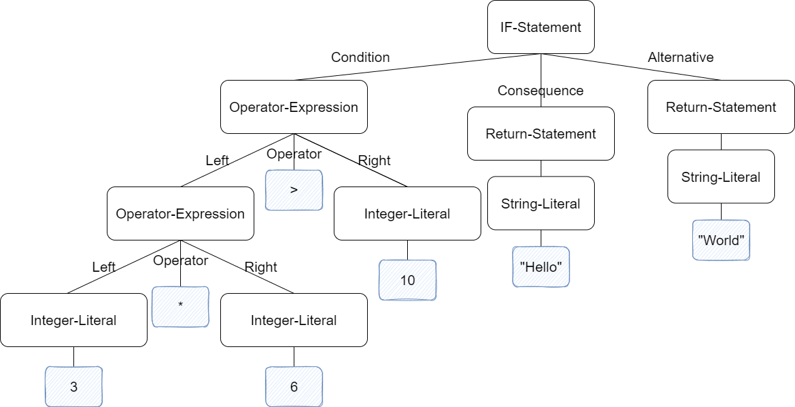

# 2.语法分析

[toc]

## 2.1 语法分析概述

语法分析器需要检查词法分析器输出的词法单元序列是否合法，并且以该词法单元序列生成对应的抽象语法树。

一个比较简单理解的概念就是—— **JSON解析器**

看下面这一段js代码：

```javascript
const json = '{"result":true, "count":42}';
const obj = JSON.parse(json);

console.log(obj.count);
// Expected output: 42

console.log(obj.result);
// Expected output: true
```

这是一段来自MDN的代码，对应的内容则是：

> JSON.parse() 方法用来解析 JSON 字符串，构造由字符串描述的 JavaScript 值或对象。提供可选的 reviver 函数用以在返回之前对所得到的对象执行变换 (操作)。

所以`parse()`函数做的就是检查原本无意义的意义的字符串是否符合json规范，并转化为对应的js值或者对象。

我们语法分析器要做的也是如此，只不过有了之前词法分析的帮助，我们不需要直接面对无意义的字符串，而是可以面对带有 “字典注释” 的词法单元。

但即便如此，我们这一步的任务还是颇为艰巨，毕竟我们这一步就要补充我们这门语言的语法标准了，工作量还是有的。

而产生的抽象语法树又有什么作用呢？

按照抽象语法树，我们可以选择自己对应语法的遍历顺序，依次遍历并求解对应的值——最后的结果就是代码执行的结果了，这就是下一节——求值系统需要做的事情了。

说到如此，可能还是有些抽象，我们不妨来直观感受一下抽象语法树到底是个什么东西。

```javascript
if (3 * 6 > 10) {
    return "Hello";
} else {
    return "Goodbye";
}
```

上述代码很简单，我们一眼就能看出其执行结果和含义，而它所产生的抽象语法树（可能的形式之一），我们可以这样子来表示：

```
{
	type: "if-statement",
	condition: {
		type: "operator-expression",
		operator: ">",
		left: {
			type: "operator-expression",
			operator: "*",
			left: {
				type: "integer-literal",
				value: 3
			},
			right: {
				type: "integer-literal",
				value: 6
			}
		},
		right: {
			type: "integer-literal",
			value: 10
		}
	},
	consequence: {
		type: "return-statement",
		returnValue: {
			type: "string-literal",
			value: "Hello"
		}
	},
	alternative: {
		type: "return-statement",
		returnValue: {
			type: "string-literal",
			value: "Goodbye"
		}
	}
}
```

还是觉得抽象？我们可以来看看所对应的结构图：



这下子就能很直观的看到了我们要构建的抽象语法树了，化抽象为直观，才能方便我们理解我们接下来的工作。

## 2.2 LL(1)文法与递归下降分析法

对于被称为 LL(1) 的文法，我们可以构造出预测分析器，即不需要回溯的递归下降语法分析器。

> LL(1)文法：从左向右扫描输入，产生最左推导，每一步只需要向前看一个输入符号来确定语法分析动作

不同于自下而上的语法分析器，自上而下的递归下降分析法是从构造AST的根节点开始，然后下降。

而要实现这个分析器，我们所要做的第一步，就是确定构成我们的抽象语法树的数据结构。

## 2.3 解析 let 语句

我们从简单的语句开始入手构建我们的抽象语法树，因为是树状结构，所以我们可以每个部分都依次编写好对应的模块，然后再组合在一起。

我们再来回顾一下我们的BY-Monkey语言的let语句：

```
let x = 10;
let y = 12 * 29;

let add = fn(a, b) {
	return  a + b;
};
```

上面的语句稍微总结一下，其实我们会发现，可以总结为以下的形式：

```
let <ident> = <expression>
```

即 `let 标识符 = 表达式` 的形式，我们用它来声明变量，用来定义函数。

而接下来，我们需要明确一下 **语句** 和 **表达式** 之间的区别：

- 语句不产生值
- 表达式产生值

例如`let x = 5`并不会产生值，而`3 + 6`会产生值。

我们的AST就是由语句结点和表达式结点来构成的，所以我们可以得到AST的数据结构的初始定义：

```
type Node interface {
	TokenLiteral() string
	String() string
}

type Statement interface {
	Node
	statementNode()
}

type Expression interface {
	Node
	expressionNode()
}
```

这里有三个接口，AST中的每个结点都需要实现Node接口，也就是必须实现`TokenLiteral()`方法和`String()`方法，
分别返回与结点关联的词法单元的字面量和其格式化的结构输出（用于Debug比较）。

我们将要构建的AST是一棵由许多相互连接的结点组成的树，有些结点实现了`Statement`接口，有些结点实现了`Expression`接口。

对于这里不理解的同学可以再看看我们之前的结构图，其实就能发现其中的端倪了。

我们先来实现一个代码块的 **结点** ，因为我们的程序的根节点，自然是一个包含了许多语句的代码块，而且也因为它方便理解。

```
type Program struct {
	Statements []Statement
}

func (p *Program) TokenLiteral() string {
	if len(p.Statements) > 0 {
		return p.Statements[0].TokenLiteral()
	} else {
		return ""
	}
}

func (p *Program) String() string {
	var out bytes.Buffer

	for _, s := range p.Statements {
		out.WriteString(s.String())
	}

	return out.String()
}
```

上述的代码中，我们实现了`Program`结点，它的`TokenLiteral()`方法，会返回这段代码块的第一个的语句结点的字面量。

